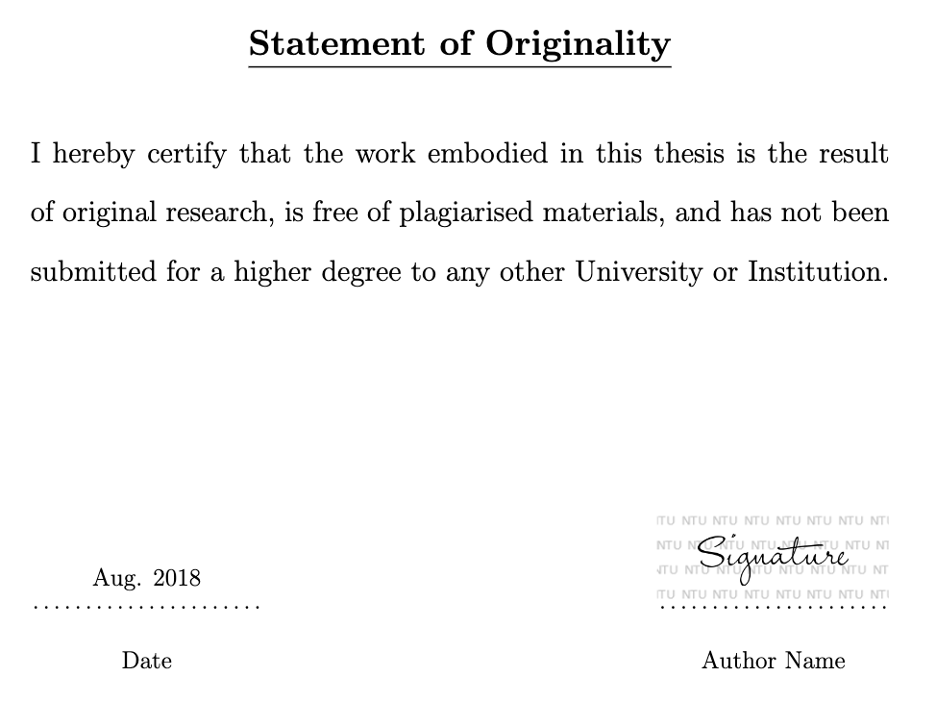
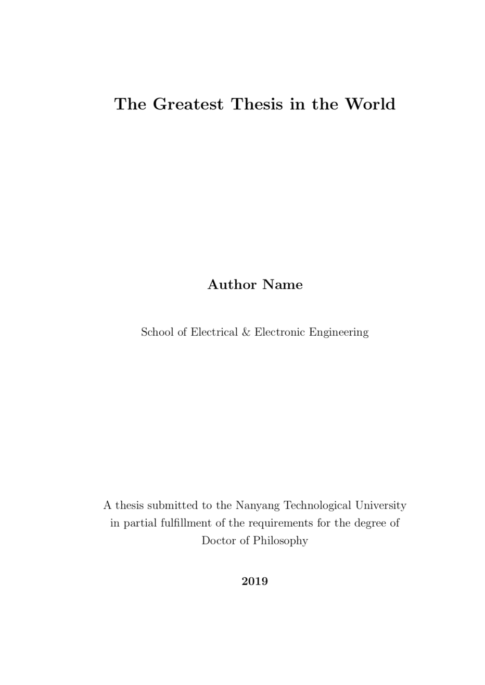

# Ph.D. Thesis Template 
## Nangyang Technological University 

This version has been verified by NTU

Author: [Chen Wang](https://wang-chen.github.io)

## Usage:

 You can see direct example in [Overleaf Project](https://www.overleaf.com/read/zbqyfqxwdmss) (View Only).

#### Main thesis
    Please change your name, title, and school in the file of Thesis.cls
    
#### Signature
   For digital signature, make your own and put it in the folder "Styles" to replace the original one.
 
#### Example:
   
   You may read my thesis on [Dr-NTU](https://hdl.handle.net/10356/105527)
   
#### Hard-cover binding (Not recommend do this by yourself)
    
    Midify the hardbound-cover.tex
   You may not need to do this by yourself if you follow the [Format](https://www.ntu.edu.sg/sasd/oas/ge/Documents/FormatofThesis_Sample_Oct2017.pdf). Just ask the stuff to follow the NTU 'standard'. 
   if your need hard-binding in 7 days, just send your thesis to [ultrasupplies](https://www.ultrasupplies.com.sg/solutions/book-binding/hard-cover-binding), and confirm with them.   

## What's New

#### Updates (Signature Watermark), Oct. 2021:

   Students and supervisors are advised to sign on the NTU watermark feature.
   This template has added the watermark as default.
   To use it properly, your signature image has to be the **png format with transparent background**. See [Signature Example](Styles/signature.png).

   

     
   

   
#### Updates (Thesis Parts), Jul. 2021:

   Add examples to split the thesis into several parts. 
   This should be useful when there are many chapters. 
   Use it between chapters and see examples in "mythesis.tex".

    \input{./Chapters/Chapter1}

    \part{Part Name: Use it when there are many chapters (Part I)}
    \input{./Chapters/Chapter2}
    \input{./Chapters/Chapter3}

    \part{Again for Second Part}
    \input{./Chapters/Chapter4}
    \input{./Chapters/Chapter5}
    
#### Updates (declaration statements), Mar. 2019:

   This version has been modified according to the [Format of final thesis](https://www.ntu.edu.sg/research/theses-dissertations), all submissions received on or after 1 Jan 2019 must include the declaration statements.
   
    i.   Title Page	
    ii.  Statement of Originality .      }
    iii. Supervisor Declaration Statement} Research Integrity - Theses / Dissertations
    iv.  Authorship Attribution Statement}	
    v.   Acknowledgements	
    vi.  Table of Contents
    vii. Summary

#### Updates (Title Page), Aug. 2018:

   We provide two styles for the title page, use "\maketitleforreview" or "\maketitle", in the file of "mythesis.tex", to choose your prefered one. Normally, the University prefers "\maketitleforreview".
        
        %\maketitle
        \maketitleforreview

Plain title page   |  Beautiful title page 
:-------------------------:|:-------------------------:
\maketitleforreview |  \maketitle
  |  

## Other Contributors
    
   [Jinming Xu](https://jinmingxu.github.io)

   [Chongtian Huang](https://nerdtomars.github.io/)
   
## Citation

   You may cite [my thesis or papers](https://scholar.google.com/citations?user=vZfmKl4AAAAJ), if you find this template is useful.

## Sponsor

   Want to support me? You can go to my official [GitHub Sponsor](https://github.com/sponsors/wang-chen) page!

   Alternatively, you can use [PayPal](https://www.paypal.com/paypalme/DrChenWang) for direct one time donation!
   
